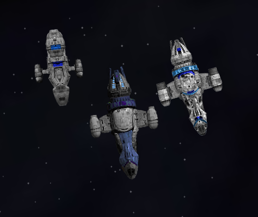
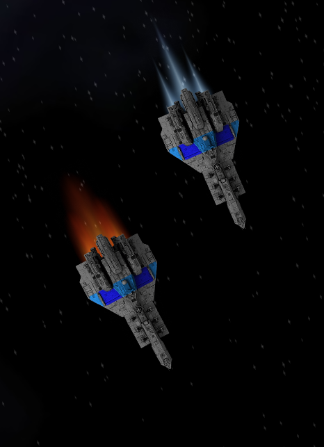
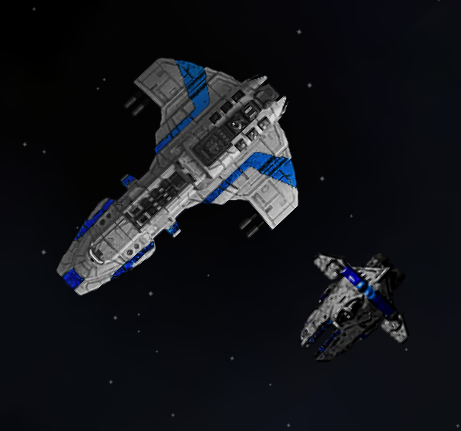
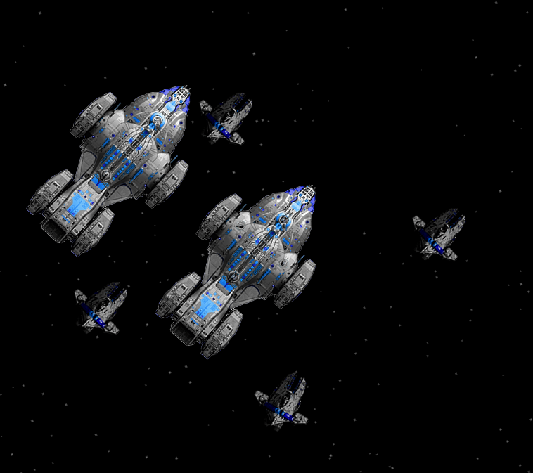
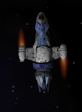

# Frontier Forge Shipyard

The Syndicate owns the factories, the banks, and the shipping lanes. The people who build the ships don't own them. The people who fly the routes don't set the prices.

The Frontier Forge is what happens when they stop asking. Steel doesn't beg.

A decentralized network of independent shipwrights, garage builders, and free port dealers who build what they need outside corporate control. The transport line — Firefly, Corsair, Serenity — runs cargo through rough space in nacelle-hulled freighters built to outrun trouble. They have been exploring deep space. Their warships keep coming back heavier, meaner, tougher. Whatever the Raza and its crew found out there... they came back different.

<table>
<tr>
<td align="center"> <em>The Firefly Line</em></td>
<td align="center"> <em>Corsairs in Flight</em></td>
</tr>
<tr>
<td align="center"> <em>Draugr & Grimnir</em></td>
<td align="center"> <em>Marauder Fleet</em></td>
</tr>
<tr>
<td align="center" colspan="2"> <em>Marauder — Four Engine Pods</em></td>
</tr>
</table>

## Ships

Seven ships across four tiers, from scrappy trade runners to a secret military-grade turret platform.

| Ship | Category | Cost | Hardpoints | Role |
|------|----------|------|------------|------|
| Grimnir | Fighter | 370k | 4G | Super heavy fighter, carrier escort |
| Firefly | Transport | 580k | 1G+1T | Small smuggler/runner |
| Corsair | Light Freighter | 1.12M | 2G+1T | Mid-tier cargo runner |
| Serenity | Light Freighter | 1.45M | 3G+2T | Top-tier hauler |
| Draugr | Medium Warship | 4.8M | 4G+3T+1Bay | Aggressive raider |
| Marauder | Heavy Warship | 6.5M | 2G+4T+2Bays | Troop carrier + fighter platform |
| Crusader | Heavy Warship | 24M | 12T | Double-deck turret fortress |

Each ship has 3-4 loadout variants (25 total), ranging from budget hauler to full combat spec.

### The Firefly Line

Firefly, Corsair, Serenity. Small, scrappy transports with side-mounted engine nacelles and reinforced hulls. Built for running cargo through rough space — and sometimes cargo that doesn't want to be found. Smuggler variants carry interference plating and jammers. The Serenity is the biggest and toughest of the three, with enough firepower to discourage anything short of a dedicated warship.

### The Grimnir

The heaviest fighter money can buy. Four gun mounts, shields thicker than most interceptors, and hull plating that keeps it in the fight long after lesser fighters are scrap. Mercenary outfits and pirate motherships swear by them. At nearly twice the price of anything else in its weight class, it's an investment — but it pays dividends when the shooting starts.

### The Draugr

A warship that refuses to stay dead. Four wing-mounted guns, three turrets, and a belly-mounted fighter bay make it an aggressive medium warship that outguns the Firebird and gives the Osprey pause. In frontier forge space, Draugr wolf packs are the deadliest thing flying.

### The Marauder

Part warship, part troop carrier, part fighter platform. Four engine pods give it surprising speed for its mass, and twin fighter bays deploy Grimnir escorts. Forty-two bunks, a security station, and a boarding complement of marines.

### The Crusader

The Frontier Forge's most ambitious project — and its most closely guarded secret. Twelve turret mounts on double-decked hardpoints, designed and built with the quiet support of scientists and engineers of conscience across human space. Nobody knows where the hulls are assembled. Nobody asks. But governments and pirates alike are collecting every Crusader they can get their hands on. She's heavy and she handles like it.

## Where to Find Them

The Frontier Forge isn't a manufacturer — it's a movement. Independent builders, garage shipwrights, and free port dealers scattered across human space.

| Planet | System | Ships |
|--------|--------|-------|
| Greenrock | Shaula | Grimnir, Corsair, Draugr, Marauder, Crusader |
| Buccaneer Bay | Algenib | Grimnir, Serenity, Draugr, Marauder, Crusader |
| Rust | Kraz | Firefly, Corsair, Serenity |
| Harmony | Girtab | Firefly |
| Lichen | Atria | Firefly |
| Sundrinker | Dschubba | Firefly |
| Freedom | Almaaz | Corsair |
| Covert | Gienah | Corsair |
| Smuggler's Den | Men | Corsair, Serenity |
| Haven | Arneb | Draugr, Marauder, Crusader |
| New Tortuga | Misam | Draugr, Marauder, Crusader |
| Wayfarer | Tarazed | Serenity, Draugr, Marauder, Crusader |

## Fleets

Four fleet types patrol frontier forge space, concentrated in the south and thinning out toward the north.

- **Frontier Forge Traders** — Firefly and Corsair convoys, occasionally escorted by a Marauder
- **Frontier Forge Raiders** — Grimnir fighter wings, smuggler support, pirate Marauders, and the occasional Crusader
- **Frontier Forge Hunters** — Draugr wolf packs. Coordinated, aggressive, and they don't leave. The deadliest thing in frontier forge space.
- **Frontier Forge Militia** — Warship patrols bolstered by armed civilian Serenities and Corsairs

## Start Scenario: Dead Run

A revolutionary thriller. Your vanguard cell's operation is blown — Syndicate Financial flagged the loan structure, enforcement is mobilizing. Someone has to fly the asset out of corporate space: an unarmed Forge Serenity, four and a half million in debt, three Syndicate ships on your tail. The frontier is waiting.

"Might have been the losing side. Not convinced it was the wrong one."

## Compatibility

All ships balanced against vanilla benchmarks with deliberate trade-offs. Compatible with vanilla Endless Sky — uses `add shipyard` and `add fleet` to integrate without overwriting. Spaceport descriptions reproduce the vanilla text with forge dealer flavor appended.

## Installation

Copy this plugin folder to your Endless Sky plugins directory:

- Windows: `%APPDATA%\endless-sky\plugins\`
- Mac: `~/Library/Application Support/endless-sky/plugins/`
- Linux: `~/.local/share/endless-sky/plugins/`

## License

GPL-3.0-or-later. See `credits.txt` for attribution.
